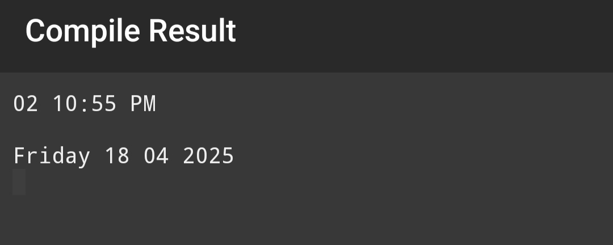
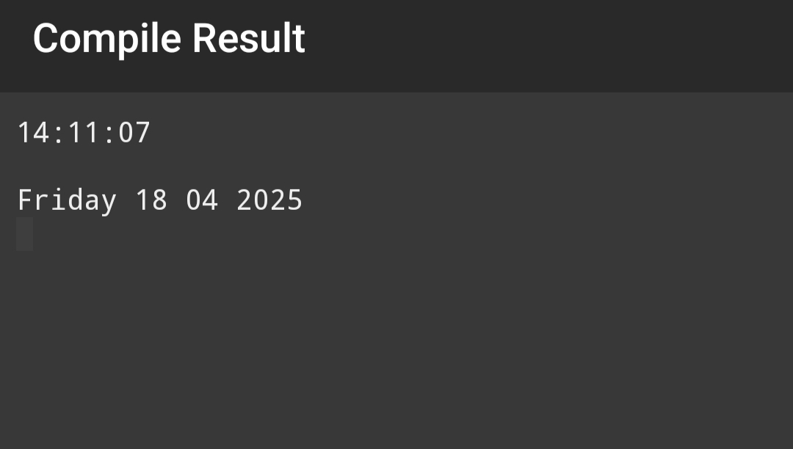

---

# Real-Time Clock Program

---


About

This program displays the current time and date continuously on the terminal. The user can choose between a 12-hour (AM/PM) format or a 24-hour format. The time and date are updated every second.


---
## 📸 Sample Screenshots

###  Menu


### Level 2


### Level 3


---


Features

Displays time in either 12-hour or 24-hour format.

Shows the current date.

Time and date are updated every second.

Clears the terminal screen after every update for a clean display.

---

How to Compile and Run
On Linux/Mac:

1. Save the code in a file, for example, clock.c.


2. Open the terminal.


3. Compile the program using GCC:

gcc clock.c -o clock


4. Run the program:

./clock


On Windows:

1. Save the code in a file, for example, clock.c.


2. Compile the program using MinGW or any C compiler.


3. Run the compiled program in the Command Prompt.
---
## Usage:
1. When the program starts, it will prompt the user to choose a time format:

1 for 12-hour format (AM/PM)

2 for 24-hour format


2. After selecting the desired time format, the program will continuously display the current time and date, updating every second.


3. The program will continue running indefinitely until manually terminated (e.g., using Ctrl+C).


---
```
digitalClockUsingC/
│
├── digitalClock.c
├── README.md
├── menu.jpg
├── format12.jpg
└── format24.jpg

```
## 🙌 Author

- **Sourav Das**
- 📧 Portfolio: [sourav5482.github.io](https://sourav5482.github.io/Portfolio/)

---

## 📜 License

This project is licensed under the MIT License - feel free to use and modify it.

